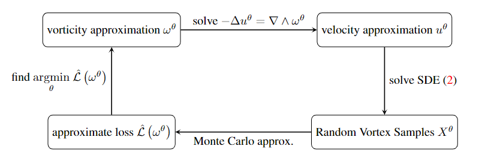

# Neural Networks-based Random Vortex Methods for Modelling Incompressible Flows

A repository with the official implementation code for the paper **"Neural Networks-based Random Vortex Methods for Modelling Incompressible Flows"**. 



## Requirements

The implementation is done in PyTorch; other packages that were used in the code are NumPy and Matplotlib. To install the requirements, use the command

```
pip install -r requirements.txt
```

## Running the code

The parameters for the initialization are stored in the parameters dictionary in configs.py -- run main
